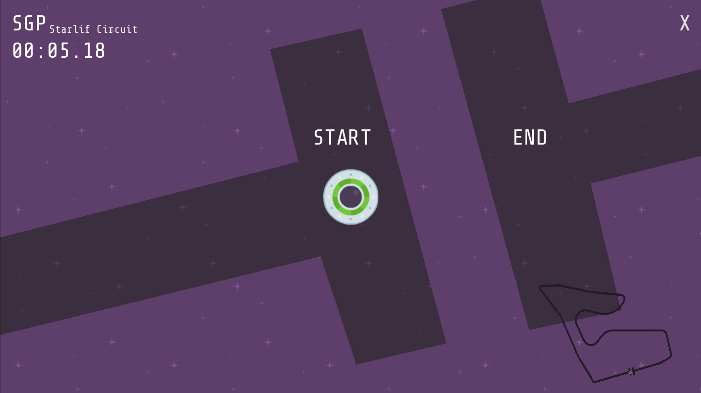

<p align="center">
  
</p>

<h1 align="center">🚀 Stellar Grand Prix</h1>

<p align="center">
  A fast-paced 2D arcade racing game where anti-gravity spacecraft compete on futuristic circuits across the galaxy.
</p>

<p align="center">
Built with <strong>Godot Engine 4</strong>, Stellar Grand Prix delivers responsive controls, high-speed gameplay, and a sci-fi atmosphere inspired by classic arcade racing games.
</p>

<p align="center">
  <a href="https://cleoaguiar.itch.io/stellar-grand-prix">
    
    
    
    
    
  </a>
</p>

---

## 📸 Preview



---

## 🎮 Play the Game

Play **Stellar Grand Prix** on Itch.io:

👉 https://cleoaguiar.itch.io/stellar-grand-prix

---

## ✨ Features

- 🚀 Fast-paced 2D arcade racing gameplay
- 🌌 Futuristic space-themed circuit
- 🎯 Keyboard controls for desktop
- 👆 Swipe gesture controls for touch devices
- 📱 Responsive window scaling
- 🖼️ Adaptive background layout
- 🔊 Sound effects and background music
- ⚙️ In-game settings for audio and display options
- 🛸 Sci-fi visual style
- ⚡ Built with Godot Engine 4

---

## 🛠️ Built With

- **Godot Engine 4**
- **GDScript**
- **Git**
- **GitHub**

---

## 🎮 Controls

### Desktop

| Action | Keyboard |
| --- | --- |
| Accelerate | ↑ |
| Brake / Reverse | ↓ |
| Turn Left | ← |
| Turn Right | → |

### Mobile / Touch Devices

| Action | Gesture |
| --- | --- |
| Accelerate | Swipe Up |
| Brake / Reverse | Swipe Down |
| Turn Left | Swipe Left |
| Turn Right | Swipe Right |

The game automatically adapts input handling depending on the device.

---

## 🔊 Audio

The game includes:

- Background music during races
- Sound effects for collisions
- Victory sound
- Restart sound
- UI button feedback
- Independent music and sound effect settings

Audio assets are organized separately from the game's visual and gameplay resources.

---

## 📱 Responsive Design

Stellar Grand Prix supports different screen sizes through responsive window scaling and adaptive background positioning.

The game is designed to maintain consistent gameplay across desktop and touch devices while adapting the interface to different resolutions.

---

## 📂 Project Organization

```text
├── assets/
│   ├── audio/
│   └── ...
├── docs/              # Documentation and screenshots
├── scenes/            # Godot scenes
├── scripts/           # GDScript files
├── .github/
│   └── workflows/     # CI/CD workflows
└── project.godot      # Godot project configuration
```

The project structure is organized to keep game content, scripts, assets, documentation, and automation separated and maintainable.

---

## 🚀 Getting Started

### Prerequisites
* Godot Engine 4
* Git

Clone the repository:

```bash
git clone https://github.com/CleoAguiar/stellar-grand-prix.git
cd stellar-grand-prix
```

Open the project with **Godot Engine 4** and press **F5** to run.

---

## 🔄 CI/CD

The project uses **GitHub Actions** to automate parts of the development and release workflow.

Current automation includes:

* Automated project validation
* Build/export verification
* Release management
* Publishing builds to Itch.io

This workflow helps keep the project buildable and simplifies the release process.

---

## 🗺️ Roadmap

- [x] Responsive window scaling
- [x] Adaptive background layout
- [x] Mobile swipe gesture controls
- [x] Sound effects
- [x] Background music
- [x] Audio settings
- [ ] Additional race tracks
- [ ] More spacecraft
- [ ] Boost mechanics
- [ ] Improved user interface

---

## 📈 Project Status

🚧 **Active Development**

Stellar Grand Prix is an ongoing personal project.

Current development focuses on improving the core gameplay experience, polishing the interface and audio, and gradually expanding the available racing content while keeping the project scope manageable.

---

## 🤝 Contributing

Suggestions, bug reports, and feedback are welcome.

Feel free to:
* Open an **Issue**
* Submit a **Pull Request**
* Share feedback about the game

---

## 📄 License

This project is licensed under the **MIT License**.

---

## 👤 Author

**Cleo Aguiar**

Game Developer | Java Backend Developer

GitHub: https://github.com/CleoAguiar

Itch.io: https://cleoaguiar.itch.io

---

⭐ If you enjoyed this project, consider giving it a star!